# 9.1 Bundled Pipelines and MLApps for Spark

These Pipelines and MLApps are available with the MCenter distribution.

## Algorithms and Statistics

The MLApp Overview dashboard and Health View remain the same for all
algorithms and are described in those sections of this document.

### Data Science View

The Data Science View is dependent on the class of algorithm used. We
provide three classes of algorithms (Classification, Regression, and
Clustering) out of the box. All statistics are reported per MLApp. As
described in the [Data Science View](./5_3.md) section, you can use the MLApp
Navigator to select statistics from each pipeline in the MLApp.

**Note:** Statistics for a given pipeline are reported as a time series
across multiple invocations unless otherwise noted. For example, if a
(re)training pipeline is scheduled to run every 24 hours, the Data
Scientist view will show trends of statistics across multiple runs
depending on selected time range.

### Classification Algorithms:

1)	Gradient boosted tree classifier (binary)
2)	Random forest classification
3)	Decision tree classifier
4)	Logistic regression

### Regression Algorithms:

1)	Gradient boosted tree regression
2)	Linear regression
3)	Random forest regression
4)	Decision tree regression
5)	Generalized linear model

### Clustering Algorithms:

1)  KMeans

We summarize the statistics that are reported for Classification,
Regression, and Clustering algorithms below.

## Classification: Training Statistics

1)  Confusion matrix of the latest run

2)  Prediction accuracy

3)  Weighted precision

4)  Weighted recall

5)  Precision per class

6)  Recall per class

|                                   | Confusion Matrix | Prediction Accuracy | Weighted Precision | Weighted Recall | Precision per class | Recall per class |
|-----------------------------------|------------------|---------------------|--------------------|-----------------|---------------------|------------------|
| Gradient  boosted tree classifier | ✓                | ✓                   | ✓                  | ✓               | ✓                   | ✓                |
| Random forest  classification     | ✓                | ✓                   | ✓                  | ✓               | ✓                   | ✓                |
| Decision tree classifier          | ✓                | ✓                   | ✓                  | ✓               | ✓                   | ✓                |
| Logistic regression               | ✓                | ✓                   | ✓                  | ✓               | ✓                   | ✓                |

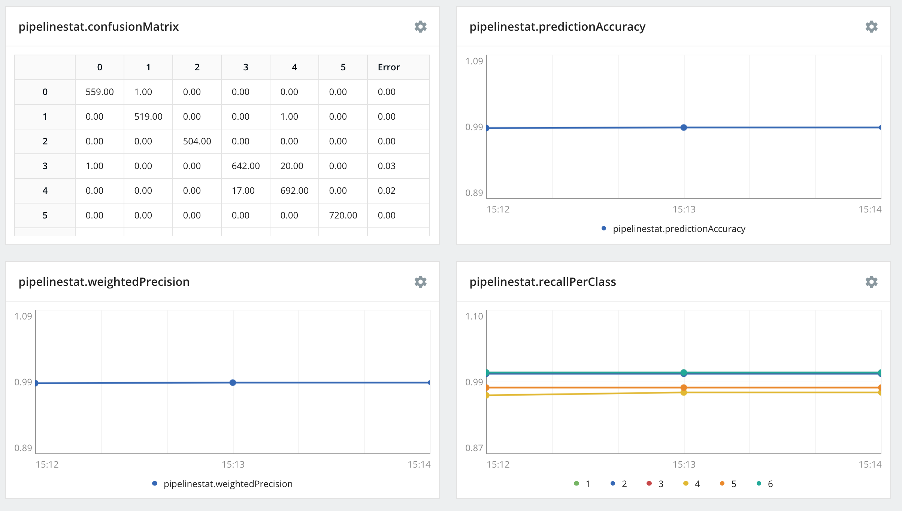

## Classification: Inference Statistics

1)  Count (total number of samples)

2)  Prediction distribution of the latest run

3)  Prediction confidence (only for logistic regression)

4)  Mean confidence per label (only for logistic regression)

**Note**: These statistics will only be available if the sparkML Inference for DataFrames component is used.

|                                  | Count | Prediction  distribution | Prediction  confidence | Mean  confidence  per label |
|----------------------------------|-------|--------------------------|------------------------|-----------------------------|
| Gradient boosted tree classifier | ✓     | ✓                        | r                      | r                           |
| Random  forest  classification   | ✓     | ✓                        | r                      | r                           |
| Decision  tree  classifier       | ✓     | ✓                        | r                      | r                           |
| Logistic  regression             | ✓     | ✓                        | ✓                      | ✓                           |

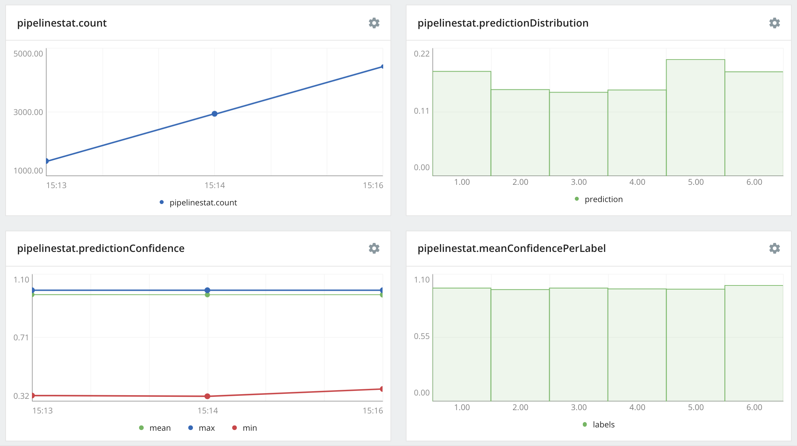

## Regression: Training Statistics

1)  Root Mean Square Error (RMSE)

2)  Mean Square Error (MSE)

3)  R2

4)  Maximum Absolute Error (MAE)

5)  Explained Variance (EV)

|                                  | RMSE | MSE | R2 | MAE | EV |
|----------------------------------|------|-----|----|-----|----|
| Gradient boosted tree regression | ✓    | ✓   | ✓  | ✓   | ✓  |
| Linear regression                | ✓    | ✓   | ✓  | ✓   | ✓  |
| Random  forest regression        | ✓    | ✓   | ✓  | ✓   | ✓  |
| Decision tree regression         | ✓    | ✓   | ✓  | ✓   | ✓  |
| Generalized linear model         | ✓    | ✓   | ✓  | ✓   | ✓  |

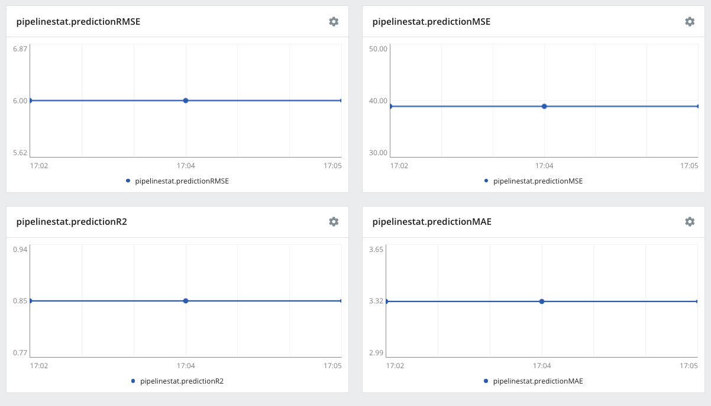
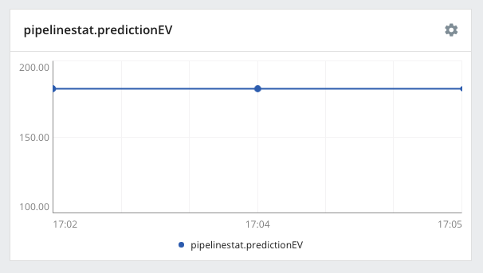

## Regression: Inference Statistics

1)  Count (total number of samples)

2)  Prediction distribution

3)  Prediction range

**Note**: These statistics will only be available if the sparkML Inference for DataFrames component is used.

|                                  | Count | Prediction distribution | Prediction range |
|----------------------------------|-------|-------------------------|------------------|
| Gradient boosted tree regression | ✓     | ✓                       | ✓                |
| Linear regression                | ✓     | ✓                       | ✓                |
| Random  forest regression        | ✓     | ✓                       | ✓                |
| Decision tree regression         | ✓     | ✓                       | ✓                |
| Generalized linear model         | ✓     | ✓                       | ✓                |

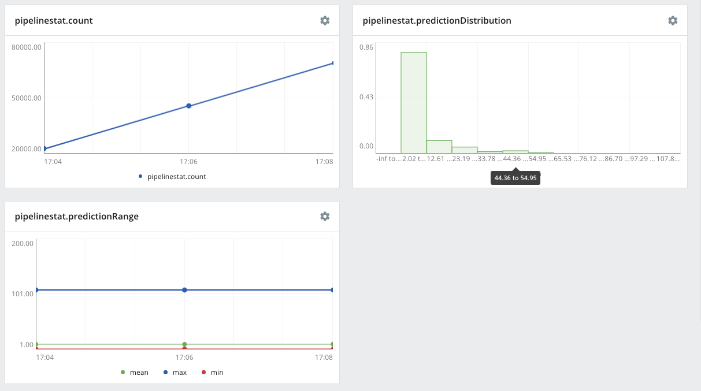

## Clustering Algorithm (KMeans):

The following table lists the statistics that are reported by the
built-in KMeans algorithm. We also list the statistics reported when
using `sparkML Inference for DataFrames` is coupled with this algorithm.

### Training Statistics:

1.  Within set sum of squared errors (WSSER)

2.  Inter-cluster distance (distanceMatrixStat)

3.  Cluster distribution (predictionDistribution)

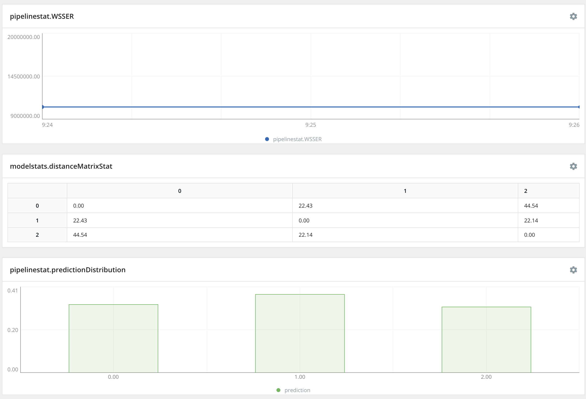

### Inference Statistics:

1)  Count (total number of samples)

2)  Cluster distribution (predictionDistribution)

## Example MLApps

We present a few example MLApps using the OOTB Spark components provided
by MCenter. Data used as input to these MLApps is included in the tar file
mlops-examples. This tar file contains two folders of interest: data and
utils:

**data**: contains several folders within it, each corresponding to an
MLApp being demonstrated in this section. Each folder associated with an
MLApp contains all the data and models needed to run the MLApp and
generate sample plots. A visualization of the pipelines associated
with each MLApp along with snapshots of plots generated by using the
sample data are described in this section.

**utils**: contains scripts that are not a part of the product, but
help with simulating scenarios to test the product. We will be using
the file-switch functionality from this folder to switch data files
used for processing by each MLApp. Note that in a production scenario,
such a script is not needed and the input to each MLApp is configured
and managed by its respective storage system.

### Example 1: Training MLApp

This MLApp contains only a training node. It trains a logistic regression
model using the sample data. Models produced by this MLApp and the
corresponding statistics associated with each model are presented in the
Data Science View dashboard. This MLApp demonstrates how you can create
a training pipeline and produce models.

The training pipeline consists of four components:

a.  Source: **CSV to DataFrame**

b.  Feature Engineering: **Vector assembler**

c.  Feature Engineering: **VectorIndexer**

d.  Algorithm: **Logistic Regression**

A screenshot of the pipeline displayed in the UI is shown in the
following figure.

Because this MLApp has no inference component, the ML Health View has no
notable data to display. The Data Science View generated using sample
data is shown in the following figure:

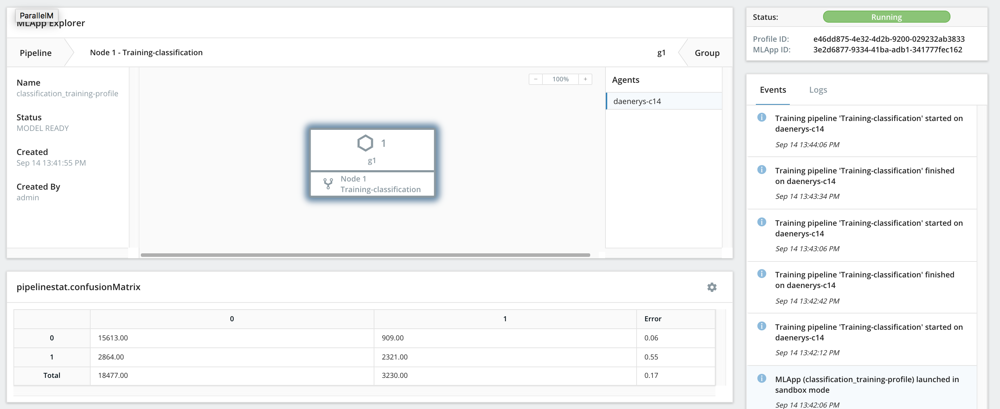

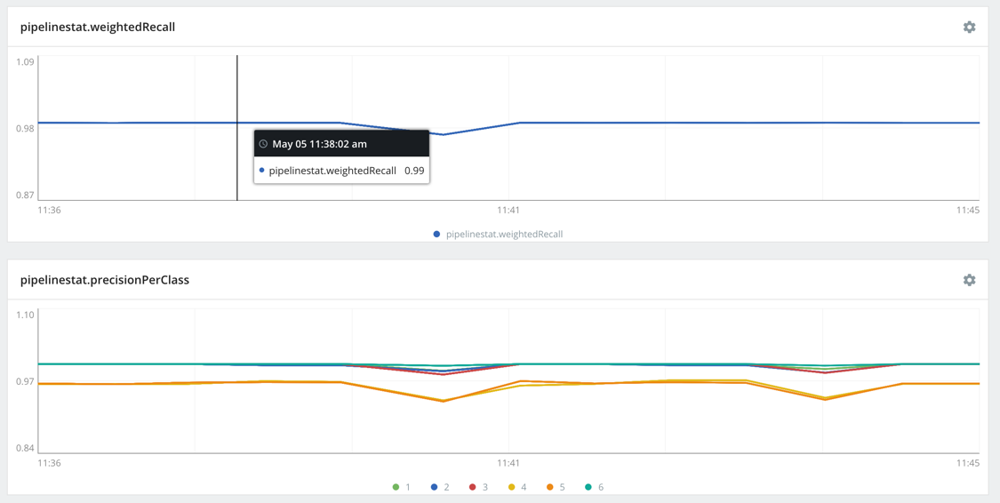

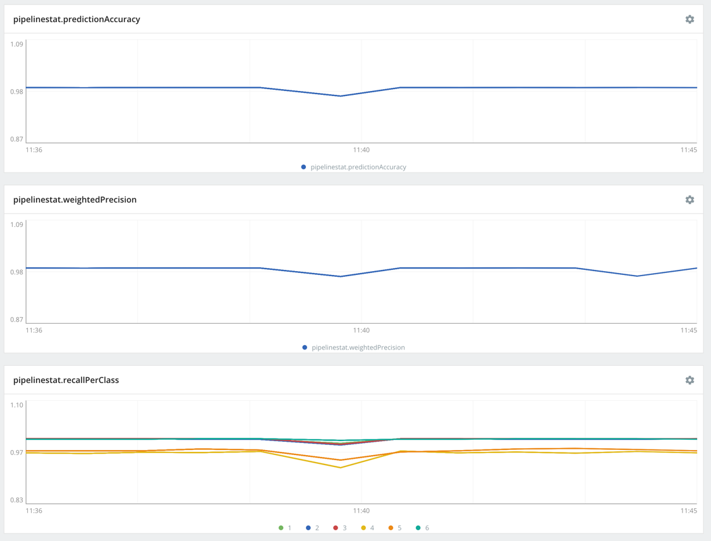

### Example 2: Classification Inference MLApp

This MLApp contains only the inference node. Models to be used for
prediction are updated using the Set Model option (see the Pipeline
Builder section for details). One can use the models produced by the MLApp
from Example 1 to generate predictions. This MLApp demonstrates how one
can create an inference-only pipeline and update it with existing
models.

The inference pipeline consists of two components:

a.  Source: **CSV to Dataframe**

b.  Algorithm: **sparkML Inference for DataFrames**

You can use the Set Model option available in the MLApp Overview dashboard
to switch between different pmml logistic regression models.

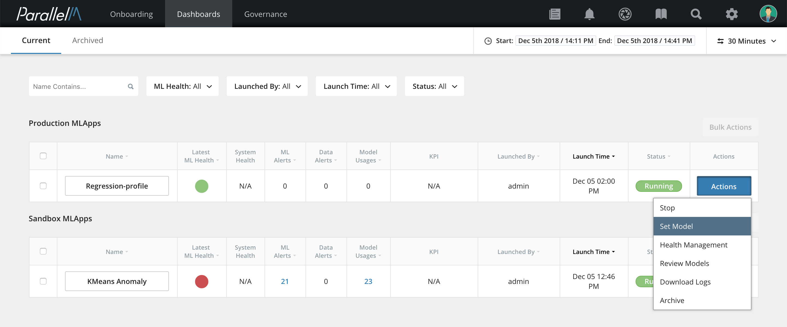

The following figure shows the Data Science View with sample data.

### Example 3: Regression MLApp

This MLApp contains both training and inference nodes and uses the Random
Forest regression algorithm. This MLApp demonstrates how one can create a
training and inference pipeline pair orchestrated such that the training
pipeline transfers its trained models to the inference pipeline. You can
set the policy for this transfer to be either automatic or manual.

The training pipeline consists of four components:

a.  Source: **CSV to DataFrame**

b.  Feature Engineering: **Vector assembler**

c.  Feature Engineering: **VectorIndexer**

d.  Algorithm: **Random Forest Regression Training**

The inference pipeline is same as the inference pipeline in Example 2.

The following figure shows the Health View with sample datasets.

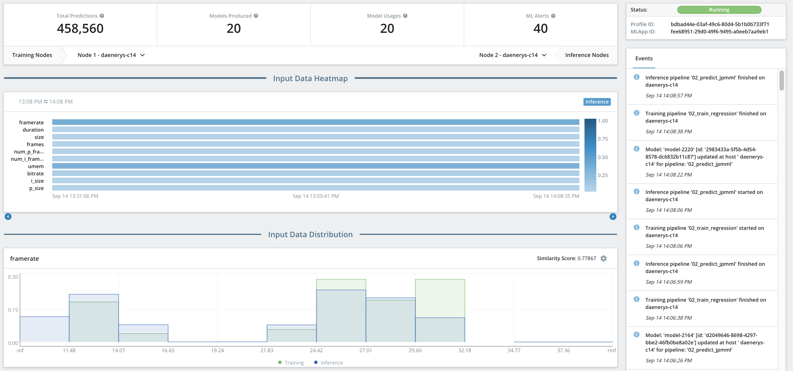

The figure below shows the Data Science View when the training node is
selected.

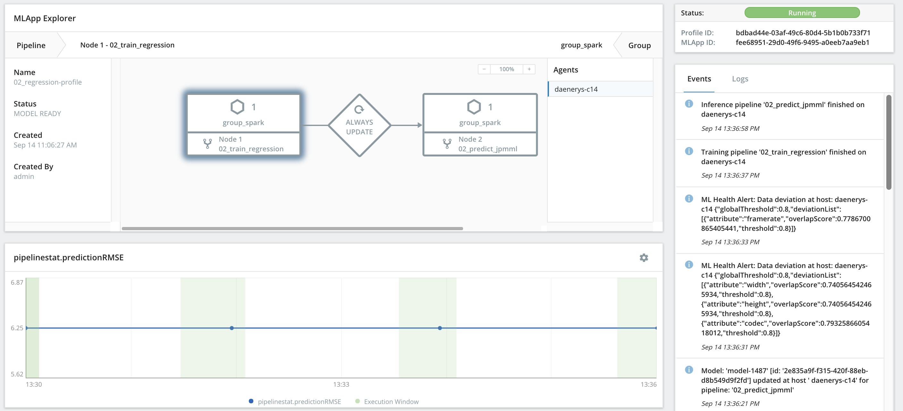

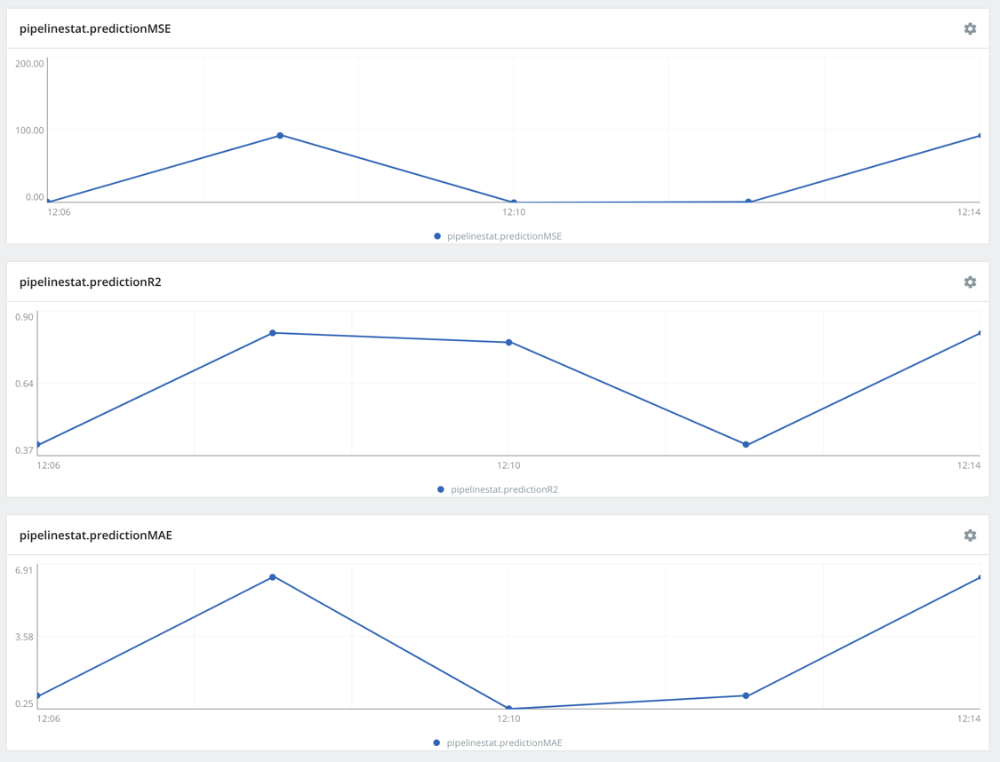

The figure below shows the Data Science View when the inference node
is selected.

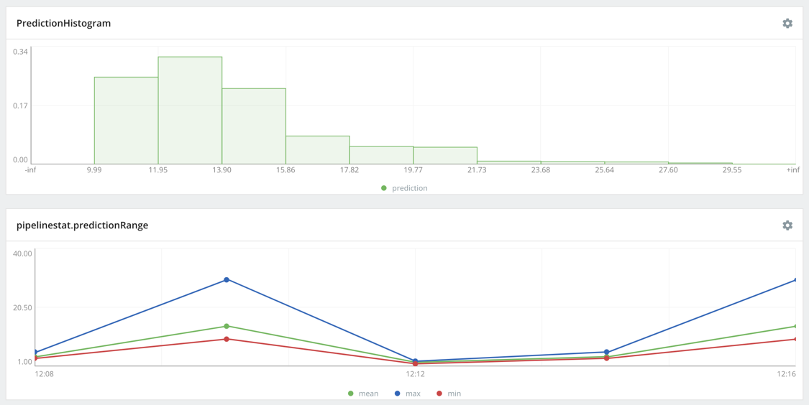

### Example 4: KMeans MLApp

This MLApp contains training and inference nodes and uses the KMeans
clustering algorithm. This MLApp demonstrates how you can create a
training and inference pipeline orchestrated pair for a clustering
algorithm. You can set the policy for this transfer to be either
automatic or manual.

The training pipeline consists of three components:

a.  Source: **CSV to DataFrame**

b.  Feature Engineering: **Vector assembler**

c.  Algorithm: **Kmeans (spark ML)**

The inference pipeline is same as the inference pipeline in Example 2.

The following figure shows the Health View when run with the sample
datasets.

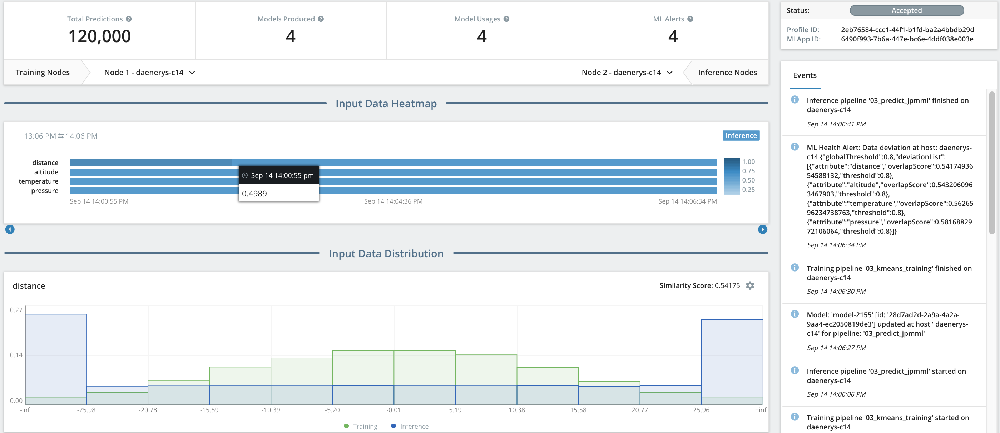

The figure below shows the Data Science View when the training node is
selected.

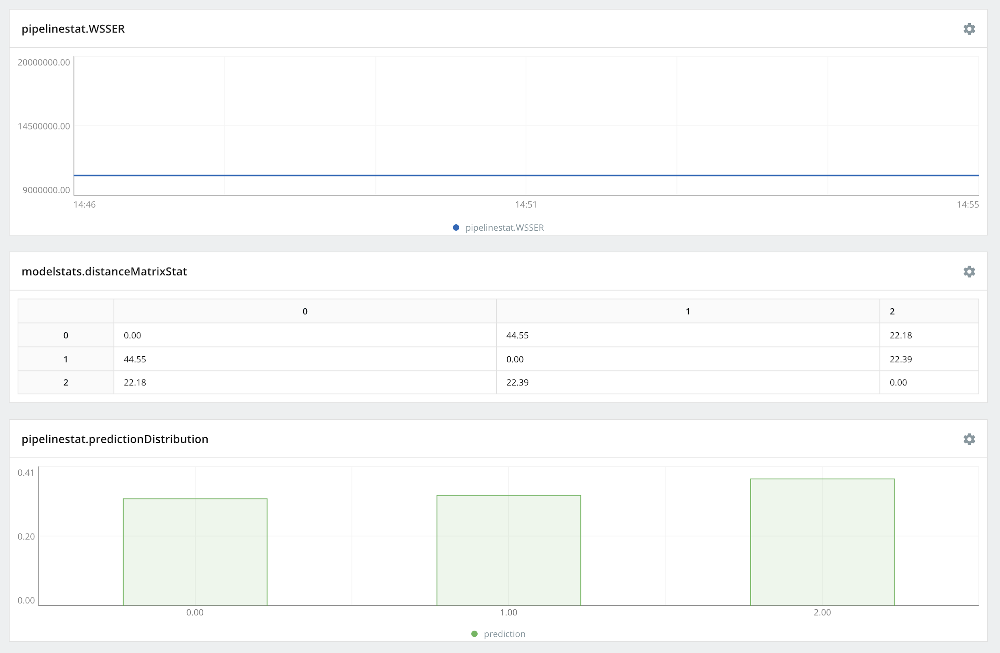

The figure below shows the Data Science View when the inference node
is selected.

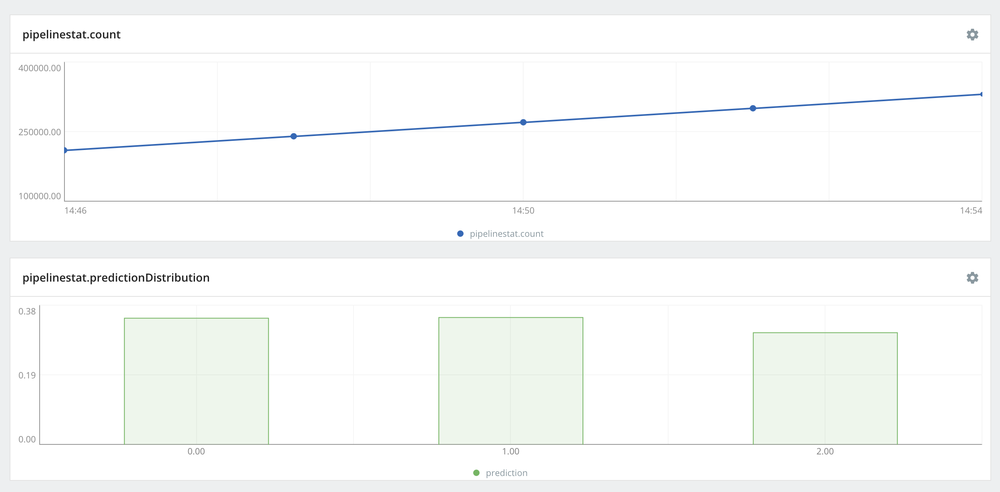

### Example 5: Canary MLApp

This MLApp demonstrates how to use the Canary feature. As in the last
example, it has a main inference pipeline, which is orchestrated with a
training pipeline. In addition, it has a canary pipeline that uses a
default model which is considered to be the baseline model. Finally, it
has a comparator node which compares the inference outputs of the main
inference pipeline and the canary pipeline. In other words, this MLApp
consists of four nodes:

1.  Training node of main pipeline

2.  Inference node of main pipeline

3.  Inference node of canary pipeline

4.  A comparator node containing the comparison logic

The following figure shows all four components.

The training pipeline contains four components:

a.  Source: **CSV to DataFrame**

b.  Feature Engineering: **Vector assembler**

c.  Feature Engineering: **VectorIndexer**

d.  Algorithm: **Logistic Regression**

The inference pipeline is same as the inference pipeline in Example 2.

The inference node of the canary pipeline is identical to the inference
node of the main inference pipeline in terms of structure, and it must
use the same input source. It is initialized with an existing model that
is considered to be the baseline model.

The comparator node contains a pipeline that accepts two parameters:

1.  The name of the output statistics from main pipeline.

2.  The name of the output statistics from canary pipeline.

The comparator pipeline will compare the two statistics and compute the
root mean square error (RMSE).

The following figure shows the Health View when run with the sample
datasets.

The figure below shows the Data Science View when the training node is
selected.

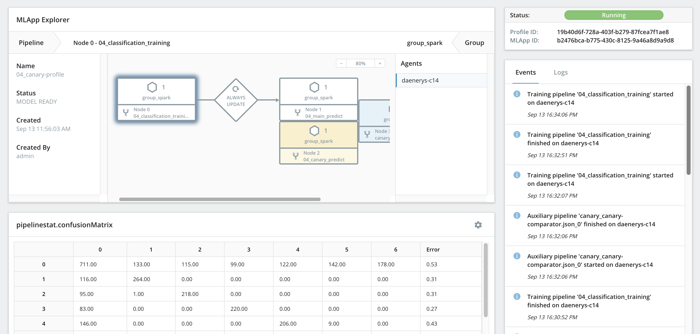
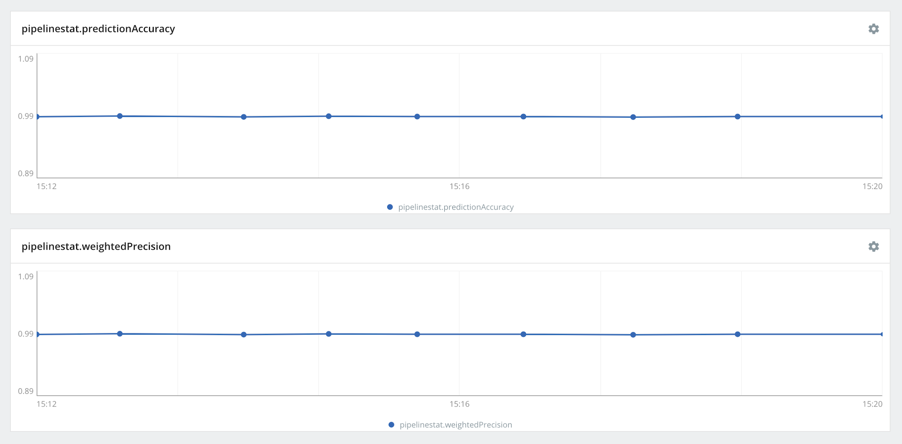
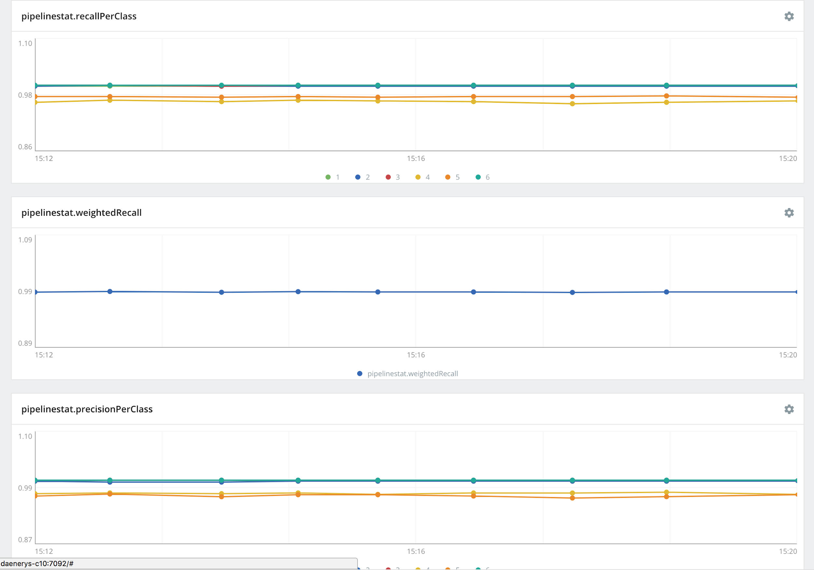

The figure below shows the Data Science View when the mainline
inference node is selected.

Canary view

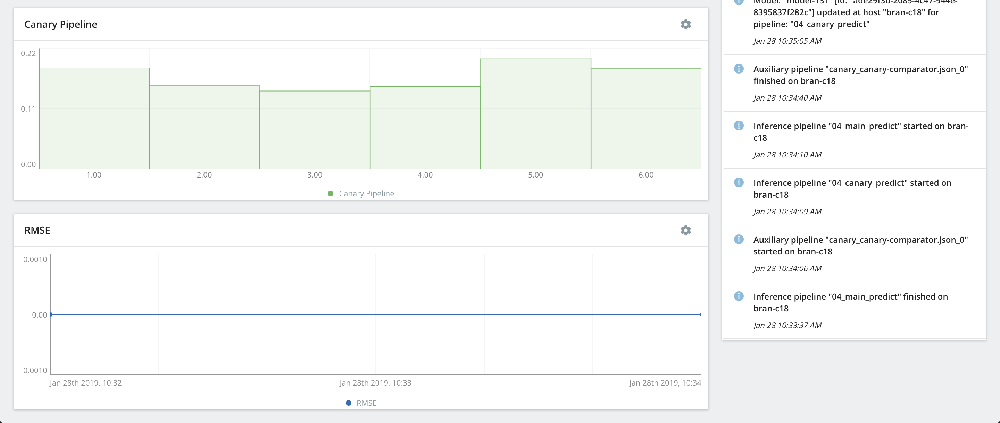

### Example 6: A/B Test MLApp

This MLApp demonstrates how to use the A/B testing feature. It contains
two inference nodes whose output is used by the comparator node. The
inference nodes are initialized with existing models.

1.  Node containing inference pipeline A

2.  Node containing inference pipeline B

3.  Node for the comparator pipeline

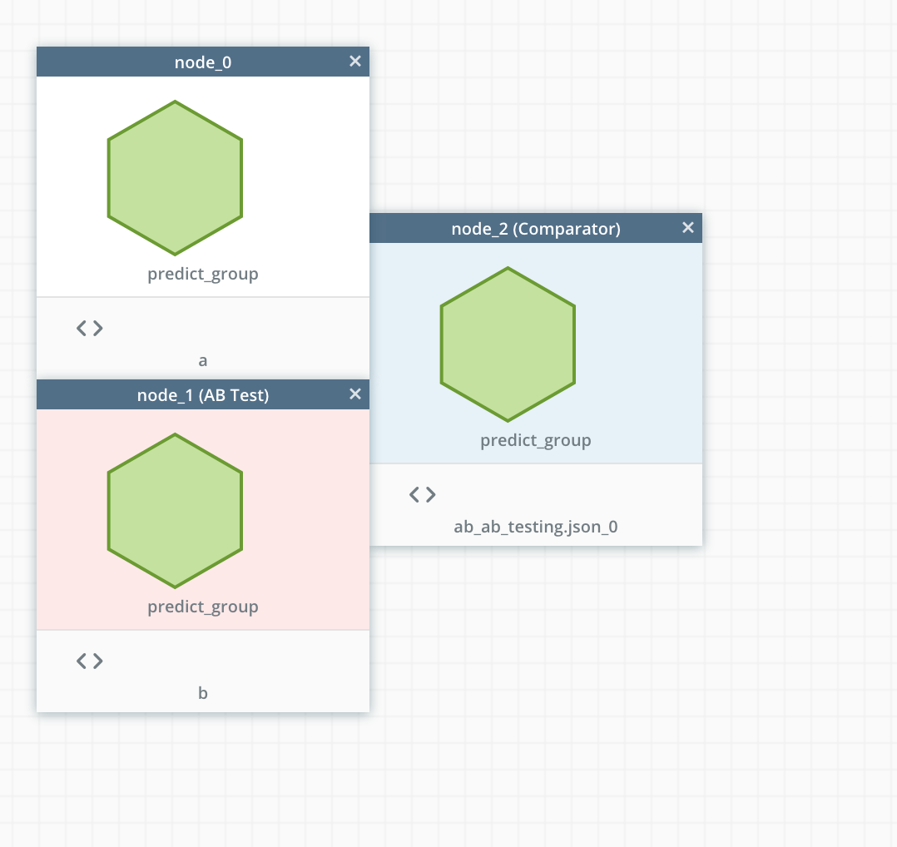

In this example, the nodes with pipelines A and B are built using
uploaded components. This uploaded code performs KMeans inference on
incoming data. Samples whose distance from the nearest cluster is
greater than a user-defined threshold are considered to be conversions.
Both A and B use KMeans clustering with different models and sample
datasets. The Data Science View and A/B screens for this MLApp are shown
below:

When you select the node for pipeline A in Data Science View, you will
see the following graphs.

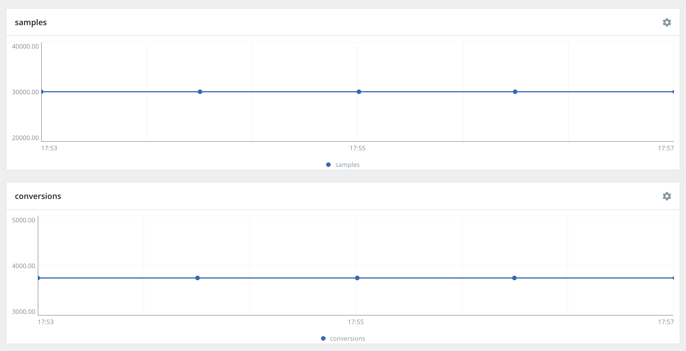

When you select the node for pipeline B in the Data Science View, you
will see the following graphs.

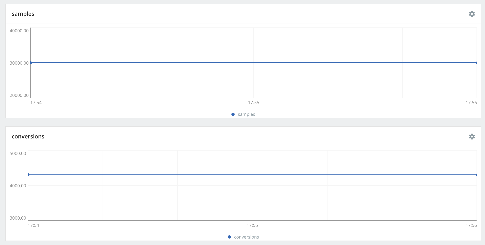

A/B Testing view

