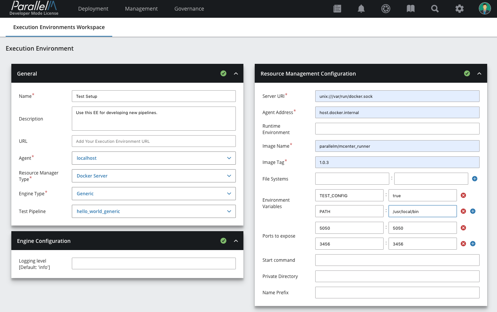
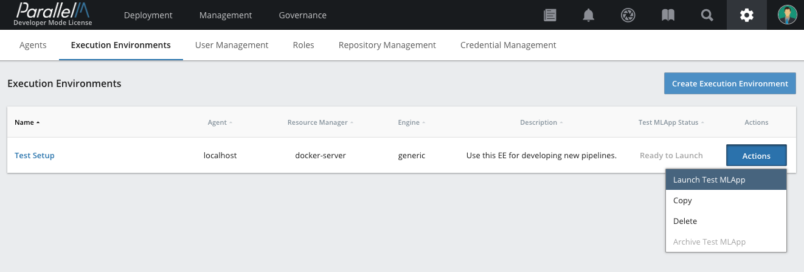

3.3 Execution Environments
==========================

Execution Environments provide a way for you to provide configuration and permissions for engines accessed by MCenter.
Each Execution Environment is associated with a single MCenter agent used to connect the engine to MCenter server and has a Resource Manager type and an Engine type.

Resource Manager Type
---------------------

Currently supported resource manager types include: Spark cluster, Spark YARN, Docker-server, Kubernetes-Azure, Kubernetes-AWS, Kubernetes-GCP, and OS. The OS resource manager will simply use the Operating System on the MCenter agent node when used with the *Generic* engine type.

Engine Type
-----------

The engine type indicates which kind of pipeline programming models are supported. Currently supported engine types are Spark, Rest Model Serving, and Generic. 

* The Spark engine type is only supported by Spark resource managers.
* Rest Model Serving provides support for uploading a model and serving REST-based predictions from the model. This can be used with any resource manager type other than Spark.
* Generic engines support general programs (e.g., Python, R, Java code) and can be used with any resource manager type other than Spark.

Creating an Execution Environment
---------------------------------

Administrators can create a new execution environment by selecting the gear-shaped Settings icon and selecting *Execution Environments* from the drop-down list.

In the Execution Environment creation window, provide a unique name and select and select the MCenter agent you want to use. Then select the resource manager and engine types from the drop-down list. Once these are selected, additional configuration fields will appear specific to the resource manager and engine types selected.

Fill in all required fields, which are marked with an asterisk.

Once you have selected the resource manager and engine types, you may also choose a test pipeline to verify your configuration. Each engine type has a built-in "Hello_world" program that can be used for this purpose or you may
create your own. Once you have created the execution environment, you can test it by running the test application
by selection *Launch Test MLApp* from the *Actions* drop-down list.

Modifying and Deleting Execution Environments
---------------------------------------------

Administrators can update or delete execution environments by selecting the gear-shaped Settings icon and selecting *Execution Environments* from the drop-down list.

To delete, select *Delete* from the *Actions* drop-down list on the environment you want to delete.

To edit, select the name of the execution environment you want to edit, update the fields, then select *Edit* and *Save*.

*Note*: Execution Environments that are currently being used to run MLApps cannot be updated or deleted.
